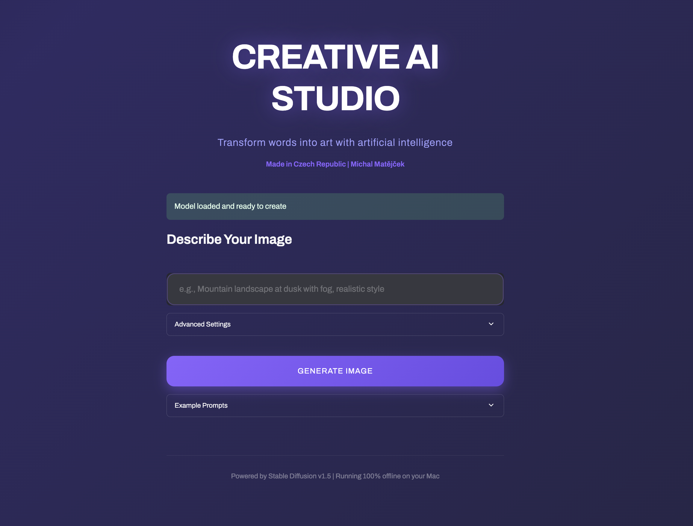
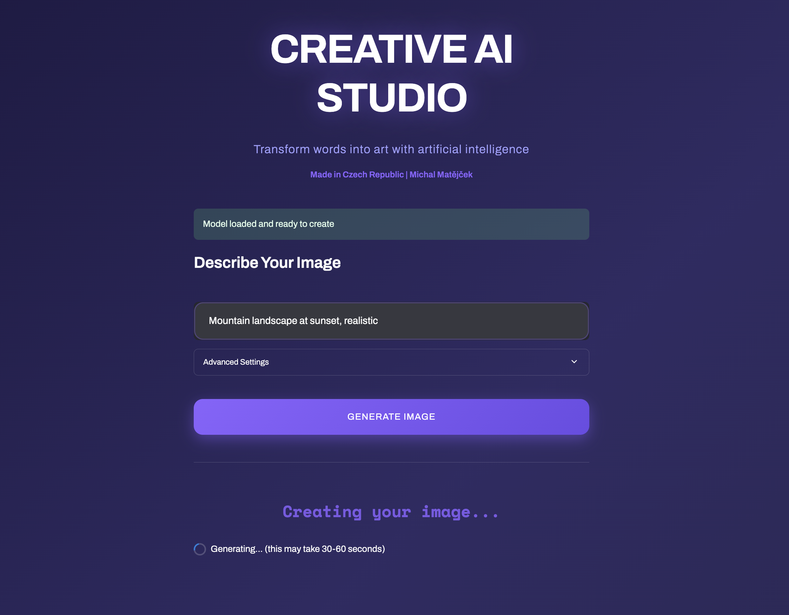

# AI Image Generator

An offline image generation application built with Stable Diffusion v1.5 and Streamlit. This project allows you to create images from text descriptions entirely on your local machine.

Made in Czech Republic by Michal Matějček

## Overview

This application uses the Stable Diffusion v1.5 model to generate images based on text prompts. After the initial model download, the entire system runs offline without requiring an internet connection. The interface features a modern dark theme with smooth animations and intuitive controls.

## Screenshots

### Main Interface
Clean, modern interface with animated gradient background:



### Generation Process
Real-time feedback during image generation:



### Generated Result
High-quality AI-generated images with download option:


## What It Does

The application takes a text description (like "mountain landscape at sunset") and generates a corresponding image. You can adjust the quality and how closely the AI follows your description. Generation typically takes 30-60 seconds on a CPU.

## Technical Details

**Core Technologies:**
- Python 3.8+
- Streamlit for the web interface
- PyTorch for deep learning operations
- HuggingFace Diffusers library
- Stable Diffusion v1.5 model

**Key Features:**
- Runs completely offline after initial setup
- CPU-optimized for Mac compatibility
- Adjustable generation parameters (quality steps, prompt strength)
- Clean code architecture with separated CSS
- Automatic model caching for faster subsequent runs

## Installation

First, clone the repository:

```bash
git clone https://github.com/MikeMat22/ai-image-generator.git
cd ai-image-generator
```

Create and activate a virtual environment:

```bash
python3 -m venv .venv
source .venv/bin/activate
```

Install the required packages:

```bash
pip install -r requirements.txt
```

## Running the Application

Start the application with:

```bash
streamlit run app.py
```

The first run will download the Stable Diffusion model (approximately 4GB), which takes 5-10 minutes depending on your connection. After this initial download, the application works offline.

The interface will open automatically in your browser at `http://localhost:8501`.

## Usage

1. Wait for the model to load (first run only)
2. Enter a description of the image you want to create
3. Optionally adjust the quality and prompt strength in Advanced Settings
4. Click "Generate Image"
5. Wait 30-60 seconds for generation to complete
6. Download the resulting image

## Configuration Options

**Quality (steps):** Controls the number of denoising iterations. Higher values produce better quality but take longer.
- 20-30: Quick generation, lower quality
- 40-50: Balanced performance (recommended)
- 60-100: Maximum quality, slower generation

**Prompt Strength:** Determines how literally the AI interprets your description.
- 5-7: More creative interpretation
- 7-8: Balanced (recommended)
- 9-15: Very literal interpretation

## Project Structure

```
ai-image-generator/
├── app.py                 # Main application logic
├── assets/
│   └── style.css         # User interface styling
├── requirements.txt       # Python dependencies
├── README.md             # This file
└── .gitignore           # Git ignore rules
```

## Example Prompts

Try these descriptions to get started:

- "Mountain landscape at dusk with reflection in lake, photorealistic"
- "Futuristic city with flying cars, cyberpunk style, neon lights"
- "Ancient temple in jungle, mystical atmosphere, ray of light"
- "Abstract colorful swirls, modern art, vibrant colors"
- "Cozy coffee shop with warm lighting, detailed, realistic"

For best results, be specific and include style keywords like "photorealistic", "digital art", or "cartoon style".

## Performance Notes

- First launch: 2-5 minutes (model download)
- Subsequent launches: Instant (model cached)
- Image generation: 30-60 seconds per image on CPU
- Memory usage: Approximately 4-5GB RAM

## Common Issues

**Model fails to load:** Ensure you have a stable internet connection for the initial model download. The model is cached locally after the first successful load.

**Slow generation:** This is normal when running on CPU. The application is optimized for Mac but generation still takes time. Reducing quality steps will speed up generation.

**Out of memory:** Close other applications. The model requires about 4GB of RAM to run properly.

## Technical Implementation

The application uses a cached model loading strategy to minimize startup time. The `@st.cache_resource` decorator ensures the 4GB Stable Diffusion model loads only once and remains in memory for subsequent generations.

Image generation happens through PyTorch's inference mode, which disables gradient calculation for better performance. The model runs on CPU with float32 precision for Mac compatibility.

The interface is built with Streamlit and uses custom CSS loaded from an external file for clean separation of concerns. All styling is applied through the `assets/style.css` file.

## Requirements

Full dependency list available in `requirements.txt`:

- streamlit 1.31.0
- torch 2.1.0
- diffusers 0.25.0
- transformers 4.36.0
- accelerate 0.25.0
- Pillow 10.1.0

## License

This project is available under the MIT License.

## Acknowledgments

Built using Stable Diffusion v1.5 by RunwayML and the HuggingFace Diffusers library. Interface created with Streamlit.

## Contact

Michal Matějček
- GitHub: [@MikeMat22](https://github.com/MikeMat22)

## Development

To contribute or modify this project, the code follows standard Python conventions. The main application logic is in `app.py`, with all CSS styling separated into `assets/style.css` for maintainability.

The model loading function includes error handling and uses the `local_files_only=True` parameter to force offline operation after the initial download.